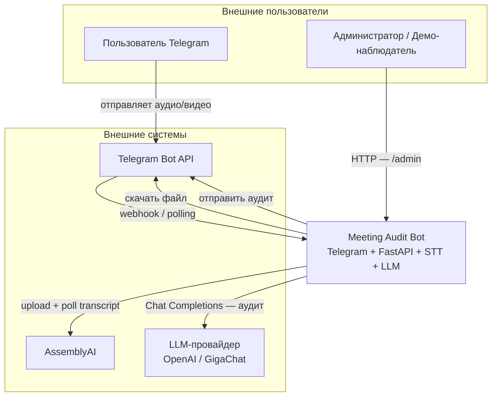
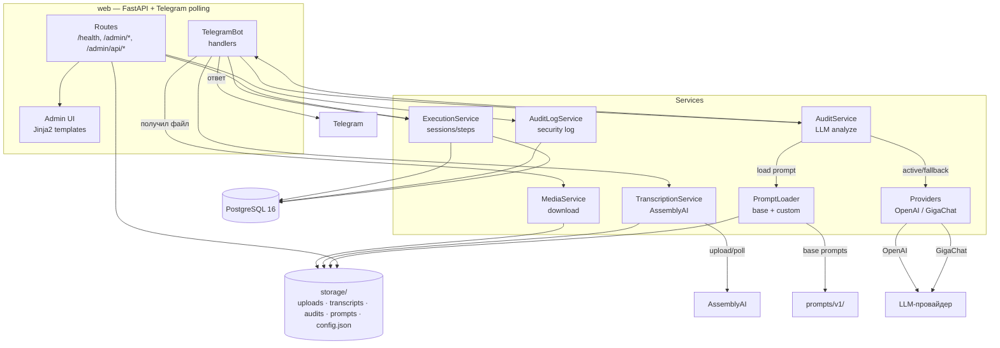
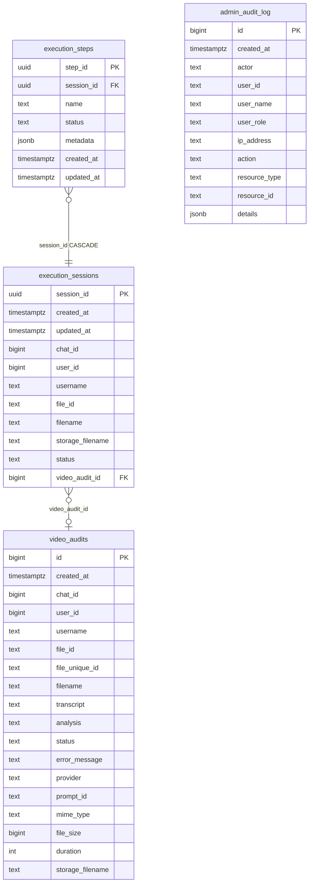
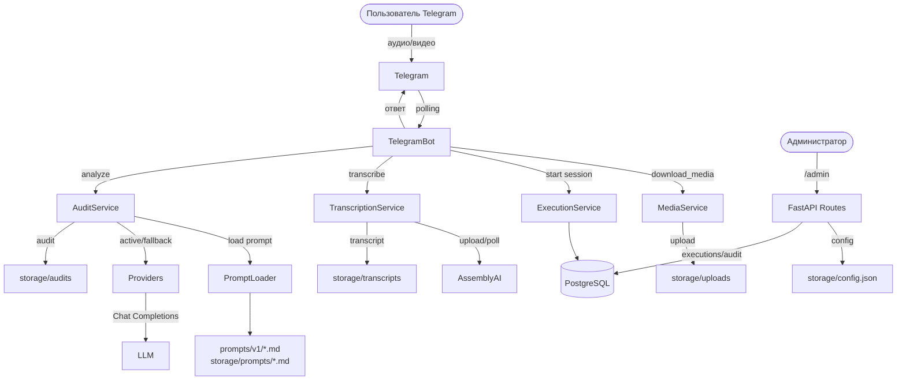
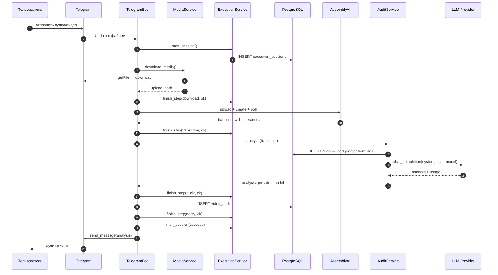
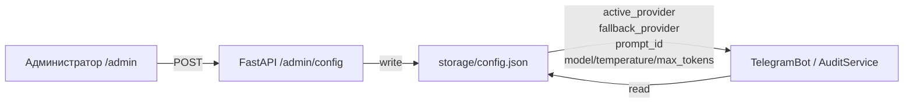
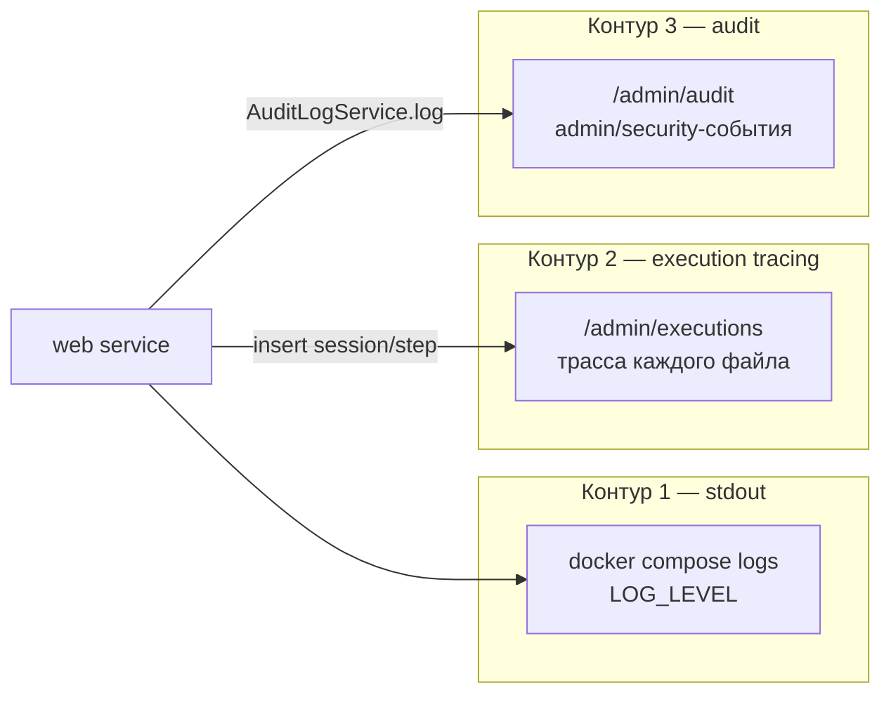

# 🏗️ ARCHITECTURE.md — Meeting Audit Bot

**Проект:** meeting-audit-bot
**Дата:** 2026-08-16
**Статус:** Engineering Layer — архитектура и путь данных.

---

## 🎯 1. Архитектурные принципы

| Принцип | Суть |
|---------|------|
| **Telegram как основной UI** | Пользователь отправляет файл в привычный мессенджер; бот отвечает аудитом.
| **FastAPI + polling в одном процессе** | Веб-админка и Telegram-бот живут в одном контейнере, что упрощает деплой кейса.
| **Секреты отдельно от runtime** | API-ключи — `.env`; операторские параметры и промпты — `storage/config.json` и `storage/prompts/*.md` (shared volume). Ключи никогда не попадают в `/admin`/браузер/config.json.
| **Fallback-by-design** | active LLM → fallback LLM → статический fallback. Система сообщает об ошибке, но не падает.
| **Observability — три контура** | stdout-логи · execution-трейсы (БД) · журнал аудита (БД).
| **Файлы как SOT для промптов** | Базовые промпты в `prompts/v1/*.md`; custom override в `storage/prompts/*.md`. `title:` frontmatter — human-readable название.

---

## 🌐 2. Context Diagram (C4 Level 1)

- **Пользователь Telegram** — отправляет файл и получает аудит.
- **Администратор** — входит в `/admin`, меняет сценарий/провайдера, смотрит сессии и аудит.
- **Telegram Bot API** — входящие и исходящие сообщения.
- **AssemblyAI** — STT + диаризация.
- **LLM** — OpenAI или GigaChat через единую абстракцию.

---

## 📦 3. Container Diagram (C4 Level 2)

- **`web`** — единый сервис FastAPI + `python-telegram-bot` polling.
- **Services** — модули с чёткими зонами ответственности.
- **PostgreSQL** — `video_audits`, `execution_sessions`, `execution_steps`, `admin_audit_log`.
- **storage volume** — файлы uploads/transcripts/audits, custom prompts, runtime config.

---

## 🗂️ 4. Модель данных

**Ключевые факты модели:**

- `video_audits` — результат обработки: транскрипт, аудит, метаданные файла, провайдер, промпт.
- `execution_sessions` + `execution_steps` — контур execution-tracing. Шаги: `download`, `transcribe`, `audit`, `notify`.
- `admin_audit_log` — контур аудита: кто/что/когда/откуда. Секреты и полные промпты не пишутся.

---

## 🔀 5. Путь данных

### 5.1. Общая схема

### 5.2. Последовательность обработки одного файла

### 5.3. Runtime-config flow

- `/admin` пишет `storage/config.json` атомарно (`json.dumps` + `write_text`).
- `AuditService` читает config при каждом вызове; миграция stale keys через `RuntimeConfig._migrate_config`.
- Смена применяется к следующей обработке без рестарта.

---

## 🤖 6. Мультипровайдерность и runtime-config

### 6.1. Унификация

Все провайдеры унифицированы на Chat Completions.

| Провайдер | Реализация | Ключ |
|-----------|-----------|------|
| OpenAI | `OpenAIProvider` (openai SDK) | `OPENAI_API_KEY` |
| GigaChat | `GigaChatProvider` → `GigaChatAdapter` (urllib, OAuth per-request) | `GIGACHAT_AUTH_KEY` |

Цепочка fallback: **active LLM → fallback LLM → статический fallback**.

### 6.2. Разделение секретов и runtime-параметров

| Где | Что | Кто меняет |
|-----|-----|-----------|
| `.env` | API-ключи, токены, `ADMIN_USER_ID` | Инженер (рестарт) |
| `storage/config.json` | `active_provider`, `fallback_provider`, `openai_model`, `gigachat_model`, `temperature`, `max_tokens`, `prompt_id` | Оператор через `/admin` |
| `storage/prompts/*.md` | Custom override промптов | Оператор через `/admin` |
| `prompts/v1/*.md` | Базовые промпты | Вшиты в образ, read-only |

### 6.3. Prompt registry

- Базовые промпты лежат в `prompts/v1/`.
- Custom override лежит в `storage/prompts/` и перекрывает базовый по `id`.
- `PromptLoader._read_title()` читает первую строку `title:` из markdown frontmatter.
- Human-readable название используется в Telegram и админке.

---

## 📝 7. Промпты

- **Файлы-SOT:** `prompts/v1/{id}.md` — вшитые defaults; `storage/prompts/{id}.md` — custom override.
- **Bootstrap:** базовые промпты поставляются в образе; custom-папка создаётся при первом сохранении.
- **Frontmatter `title:`** — источник human-readable названия сценария.
- **Валидация:** `PromptLoader.validate_prompt()` проверяет наличие обязательных блоков (`Роль`, `Задача`, ...).
- **Atomic write:** `/admin` перезаписывает custom-файл через `write_text`.

Подробно — [📝 `PROMPT_ARCHITECTURE.md`](PROMPT_ARCHITECTURE.md).

---

## 📊 8. Наблюдаемость

**Три независимых контура observability:**

### 8.1. stdout-логирование

- `LOG_LEVEL` через `logging_config.dictConfig`.
- Формат: `%(asctime)s | %(levelname)s | %(name)s | %(message)s`.

### 8.2. Execution tracing

- Каждая обработка = `execution_session` со шагами `download`, `transcribe`, `audit`, `notify`.
- Шаги несут `metadata` (JSONB): размер файла, длина транскрипта, provider, model, токены.
- Просмотр: `/admin/executions` (read-only, demo допущен).

### 8.3. Audit

- `admin_audit_log`: `admin.login_success`, `admin.config_update`, `admin.provider_test`, `admin.rbac_denied`, `telegram.quota_exceeded`.
- Просмотр: `/admin/audit` (read-only, demo допущен).

---

## 🛡️ 9. Безопасность и доступ

- **Секреты** — только `.env`, в репозитории только `.env.example` с placeholder'ами.
- **Demo-RBAC** — `ADMIN_TOKEN` (admin) и `ADMIN_DEMO_TOKEN` (read-only demo). Backend guard на мутациях.
- **Дневной лимит** — 5 успешных обработок на пользователя, `ADMIN_USER_ID` exempt.
- **Cookie** — `meeting_audit_admin`, `httponly`, `secure`, `samesite=lax`.
- **IP** — извлекается по цепочке `X-Forwarded-For` → `X-Real-IP` → `client.host`.

Подробно — [🛡️ `SECURITY_NOTES.md`](SECURITY_NOTES.md).

---

## 📚 Связанные документы

- [🏠 `README.md`](../README.md) — главная страница проекта.
- [📋 `docs/SPEC.md`](SPEC.md) — функциональная спецификация.
- [📝 `docs/PROMPT_ARCHITECTURE.md`](PROMPT_ARCHITECTURE.md) — архитектура промптов.
- [🔌 `docs/API_CONTRACT.md`](API_CONTRACT.md) — HTTP API.
- [🛡️ `docs/SECURITY_NOTES.md`](SECURITY_NOTES.md) — безопасность.
- [🚀 `docs/DEPLOYMENT_GUIDE.md`](DEPLOYMENT_GUIDE.md) — развёртывание.
