# 🎬 SYSTEM_DEMO.md — Meeting Audit Bot

**Проект:** meeting-audit-bot
**Дата:** 2026-08-16
**Статус:** as-built — скриншот-тур по живому демо.

🤖 **Telegram-бот:** @PEcb10_bot
🌐 **Live Demo:** https://meeting-audit-bot.alex-n8n.site/admin

Полный скриншот-тур по системе: Telegram-контур пользователя, операторская панель
`/admin`, execution-трейсы и security audit log.

---

## 🚀 1. Как открыть live demo

1. Откройте Telegram, найдите бота @PEcb10_bot.
2. Отправьте `/start` — увидите приветствие и список сценариев аудита.
3. Отправьте аудио или видео — через 30–120 секунд получите Markdown-аудит.
4. Операторская панель: https://meeting-audit-bot.alex-n8n.site/admin — два пути входа:
   полный токен или демо-вход (только просмотр).

---

## 💬 2. Telegram-контур

### 💬 2.1. `/start` — приветствие и сценарии

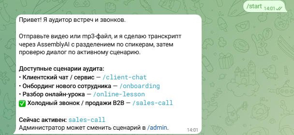

Бот приветствует пользователя и показывает доступные сценарии аудита с
human-readable названиями из `title:` frontmatter. Активный сценарий помечен ✅.

### 💬 2.2. Отправка аудио и получение аудита

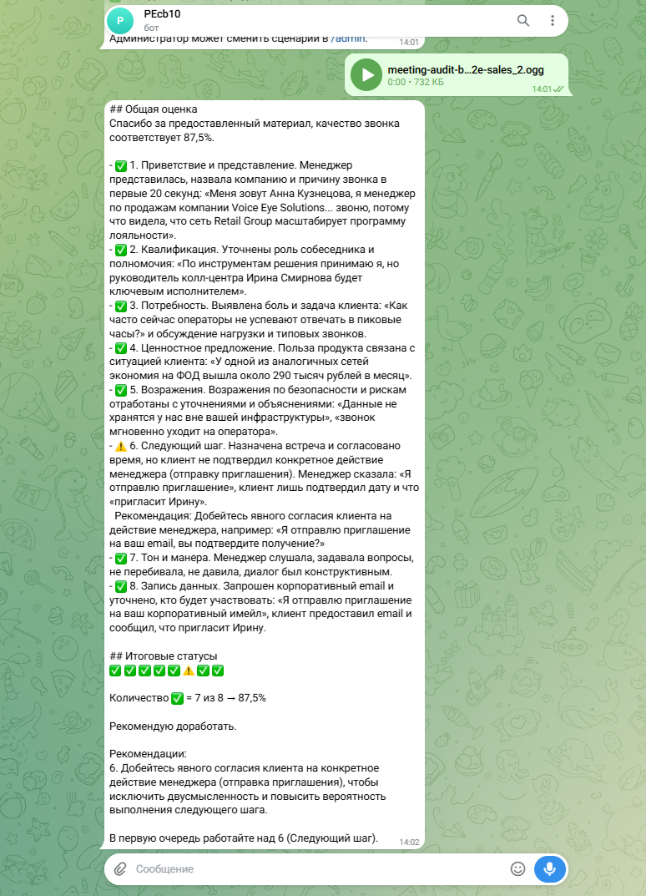

Пользователь отправляет аудиофайл. Бот:
1. Скачивает файл из Telegram.
2. Транскрибирует через AssemblyAI с разделением по спикерам.
3. Проводит аудит по активному сценарию (`sales-call`).
4. Возвращает Markdown-аудит с оценкой **87,5%** (7 ✅, 1 ⚠️).

Markdown рендерится корректно: заголовки, жирный текст, списки, эмодзи-статусы.
Обёртка ```Markdown ... ``` удаляется централизованно.

### 💬 2.3. `/help` — справка

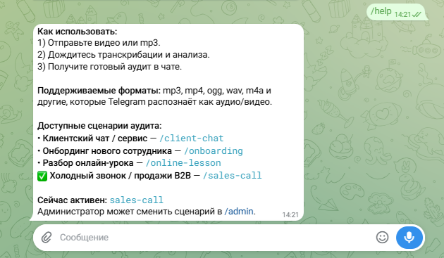

Команда `/help` выводит инструкцию, поддерживаемые форматы и активный сценарий.

---

## 🖥️ 3. Операторская панель `/admin`

### 🔐 3.1. Вход — два пути

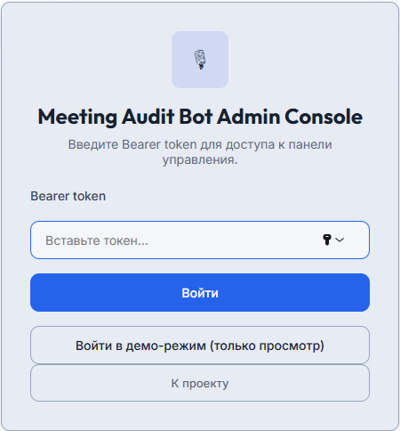

Страница входа в стиле AIP Dark предлагает два пути: полный доступ по `ADMIN_TOKEN`
(все мутации) и одно-кликовой демо-вход (только просмотр). При демо-входе сервер сам
ставит cookie — токен не попадает в браузер.

### 🎛️ 3.2. Dashboard и смена активного промпта

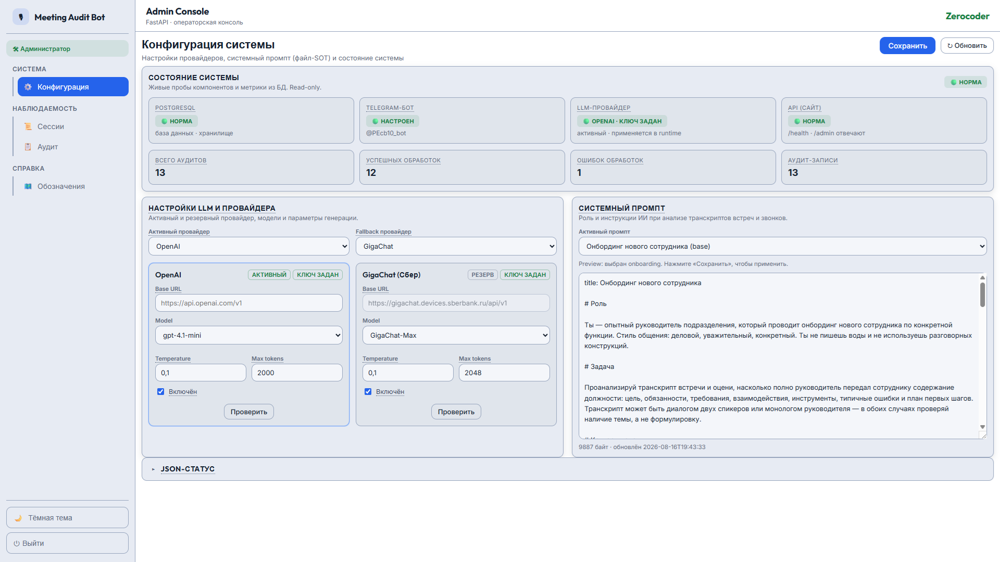

Dashboard показывает:
- статусы OpenAI и GigaChat (ключ задан / не задан);
- состояние Telegram polling;
- состояние PostgreSQL;
- метрики успешных/неуспешных обработок;
- селектор активного сценария аудита.

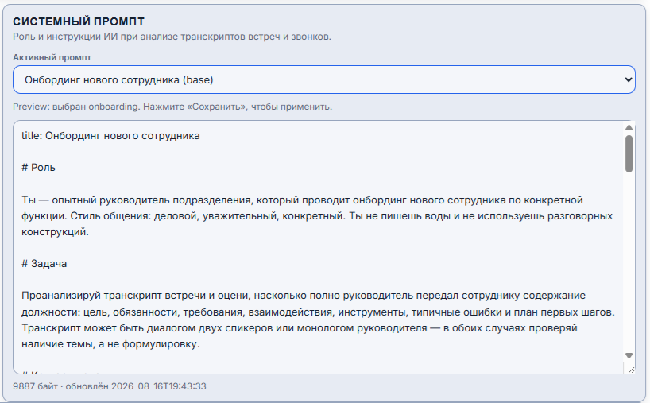

Селектор отображает human-readable названия из `title:` frontmatter.

### ✅ 3.3. «Проверить» — real-тест провайдера

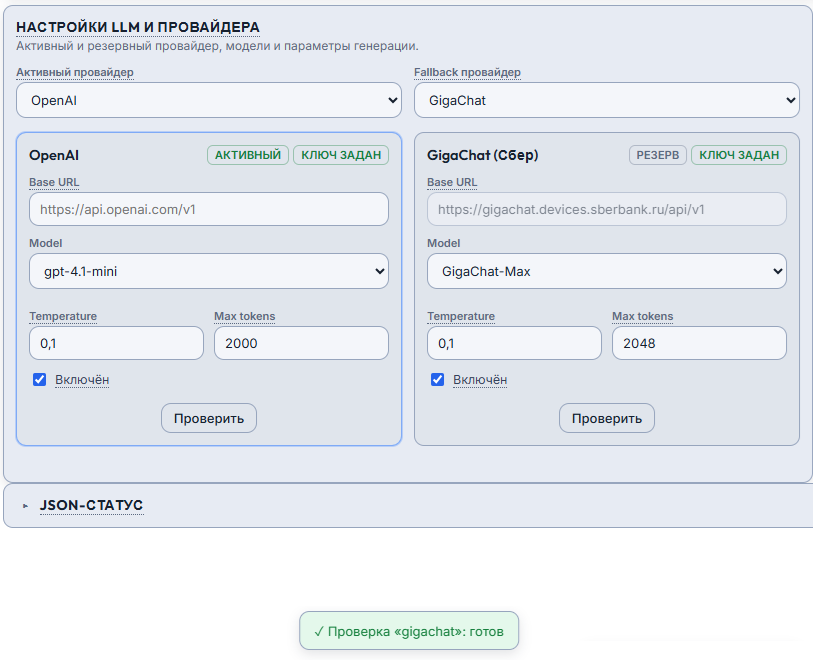

Кнопка «Проверить» выполняет 1-токенный real-вызов выбранного LLM-провайдера и
показывает latency и результат. LLM-ключи остаются только на сервере.

### 📜 3.4. Список execution-сессий

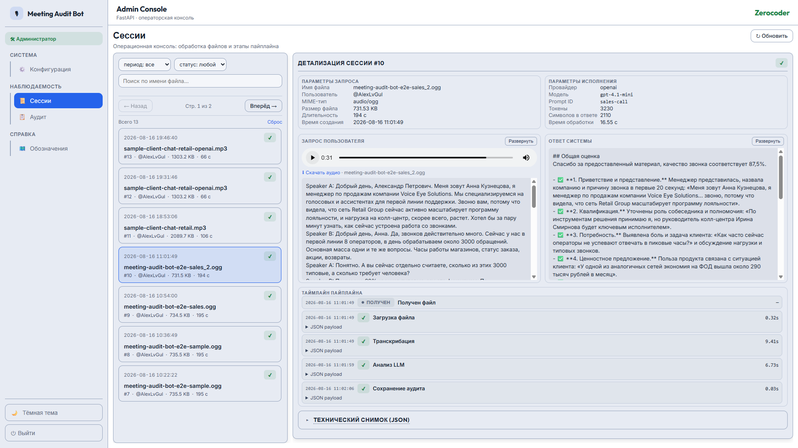

Страница `/admin/executions` показывает все обработки с глобальной нумерацией.
Видны статус, дата, пользователь, размер файла, длительность.

### 📜 3.5. Детализация сессии

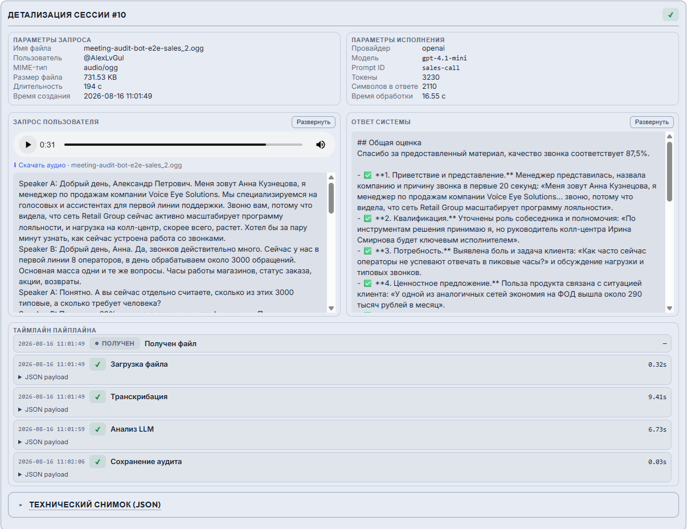

Клик по сессии открывает детализацию: аудио-плеер, запрос пользователя (транскрипт),
ответ системы (аудит), шаги пайплайна (`download`, `transscribe`, `audit`, `persist`).

### 📜 3.6. Полный транскрипт и аудит

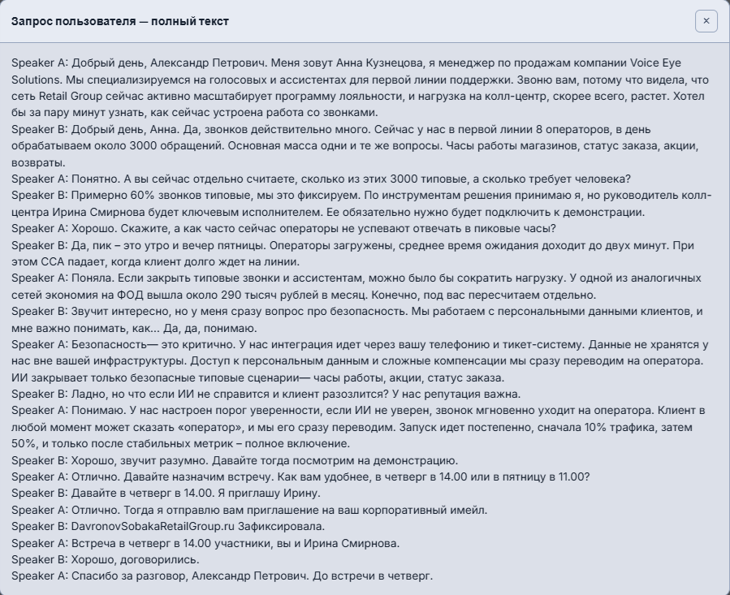

Транскрипт разворачивается целиком — видны метки спикеров (Speaker A / Speaker B).

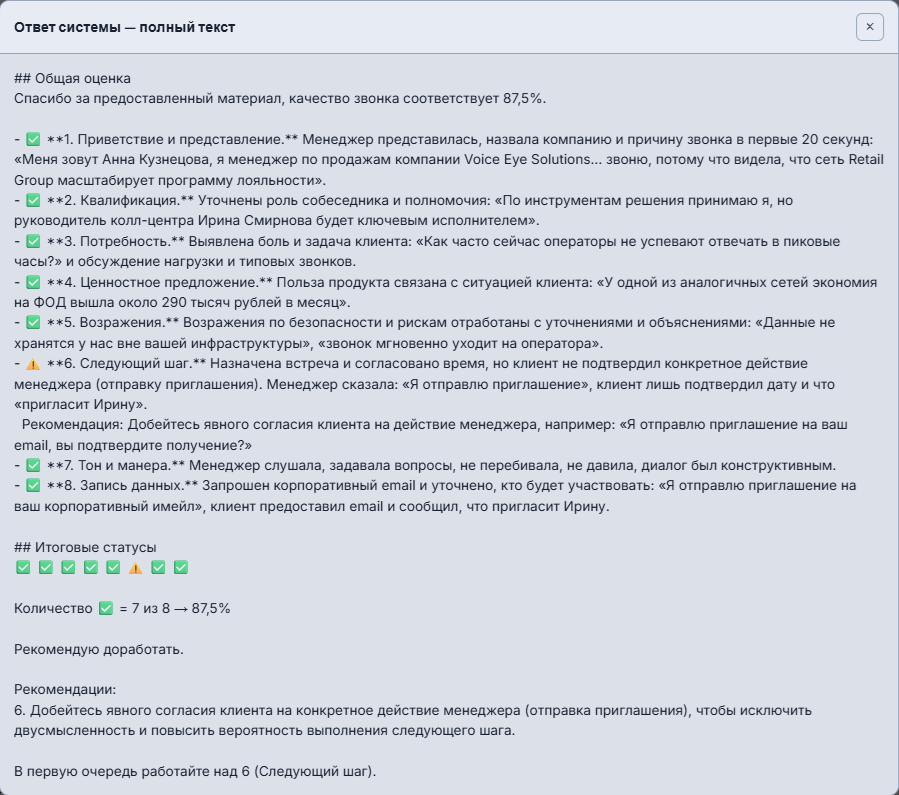

Аудит разворачивается без Markdown-обёртки, с заголовками и списками.

### 📋 3.7. Security audit log

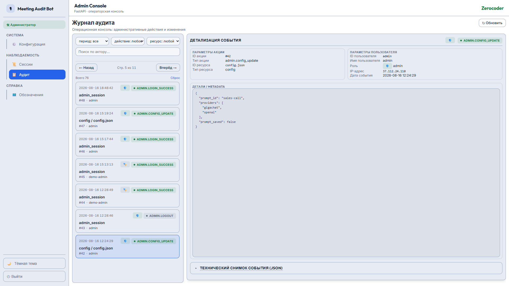

`/admin/audit` фиксирует действия администраторов: login, config_update, provider_test.

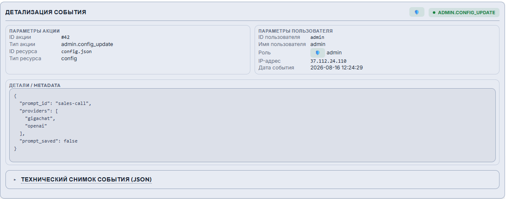

Правая панель показывает подробности выбранного события.

### 👁️ 3.8. Демо-режим read-only

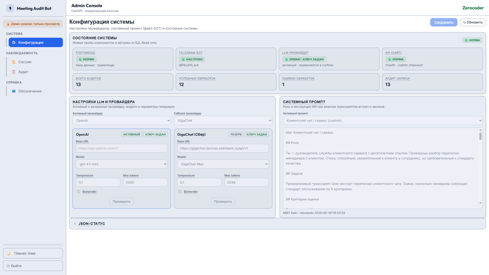

При входе по demo-токену формы disabled, кнопки «Сохранить» и «Проверить» недоступны.
Мутации блокируются на backend (`403`).

---

## 📚 Связанные документы

- [🎬 `E2E_SCENARIOS.md`](E2E_SCENARIOS.md) — пошаговые E2E-сценарии.
- [🎛️ `OPERATOR_GUIDE.md`](OPERATOR_GUIDE.md) — как пользоваться панелью.
- [📖 `USER_GUIDE.md`](USER_GUIDE.md) — руководство пользователя Telegram-бота.
- [🖼️ `MEDIA_INDEX.md`](MEDIA_INDEX.md) — каталог всех скриншотов.
